# A12 Docs RAG On Premise

## Build a RAG pipeline with Milvus
### AI VN Team - 5.2026

---

# Agenda
- Goals of moving from Azure cloud to on premise
- Compare architecture solution on Azure cloud and on premise with Milvus
- Sync data in ingestion on premise
- Enhance chunking strategy for chunking challenges 
- Compare their retrieval strategy
- Compare their performance

---

# Goals 

- Minimize the dependence of Azure cloud, reduce cost
- Regulate GDPR and sovereign on our infrastructure
- Find the solution that keep the same performance like A12 RAG on Azure
- Be easy to control and extend nuance problems in A12 RAG later

---

# Overview A12 RAG architecture on Azure cloud
- Azure AI search

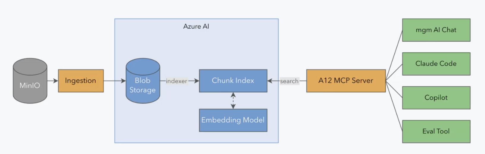

---

# Overview A12 RAG architecture on on premise
- Milvus
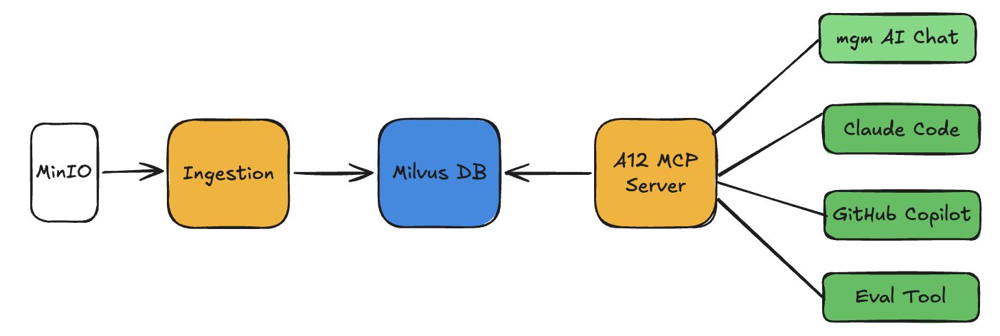

- Remove Azure AI search and Azure Storage services.
- Keep using Azure Open AI for text-embedding-3-large

---

# A12 Docs ingestion on premise
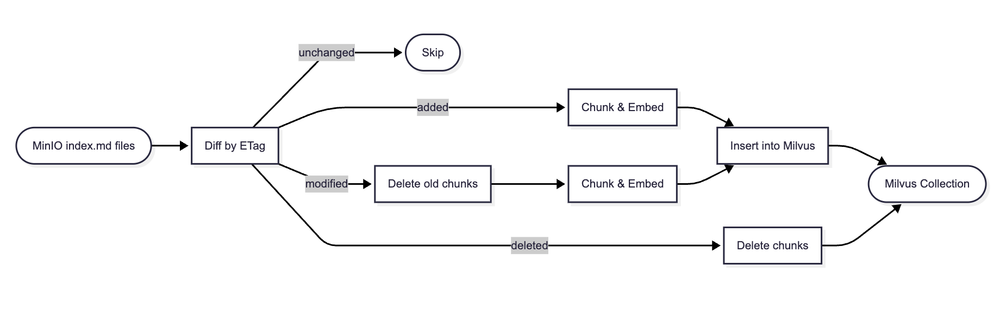

- Still run ingestion in schedule
- Use Milvus to manage sync data from MinIO to Milvus
- Each A12 docs map to a partition in Milvus collection -> ANN search is scoped to one or more partitions explicitly.

---

# A12 Docs ingestion on premise
- Sample logs during sync data
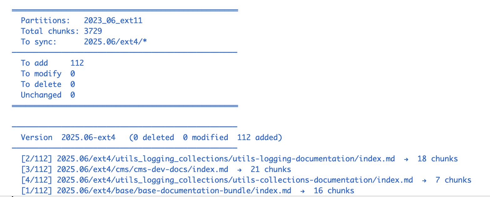 

---

# A12 Docs ingestion on premise

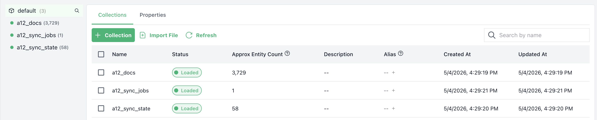
- a12_docs: manage chunks in A12 docs
- a12_sync_jobs: manage ingestion jobs
- a12_sync_state: manage a12 docs files synced

---

# Chunking Challenges: Nuance problems in A12 RAG Docs
- **Problem 1**: A12 Docs often has intra-references. Source url: https://geta12.com/#/docs/2023.06/ext11/data_services/dataservices-documentation-src%23cdd-single-server

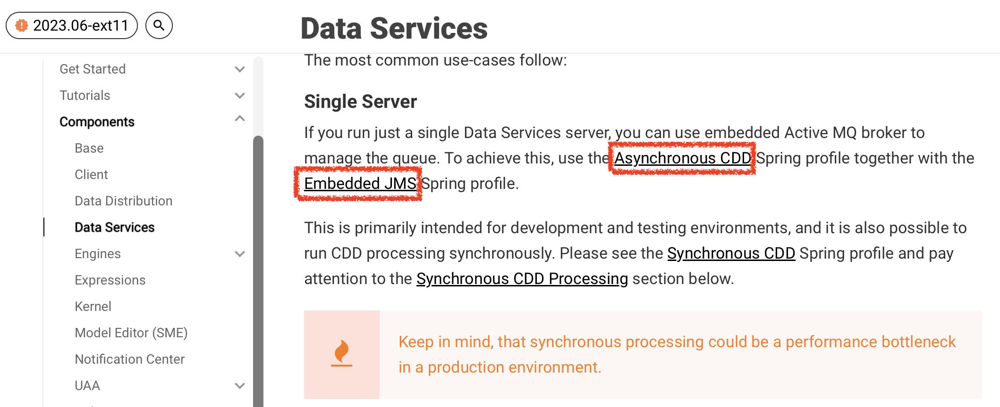

---

# Chunking Challenges: Nuance problems in A12 RAG Docs
- Cannot answer the questions need the content of these intra-references

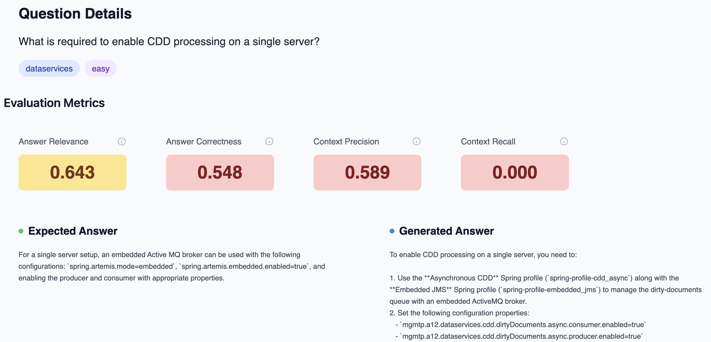

---

# Chunking Challenges: Nuance problems in A12 RAG Docs
- **Problem 2**: A12 Docs also has long code block. Source url: https://geta12.com/#/docs/2023.06/ext11/build_and_deployment/a12-stack

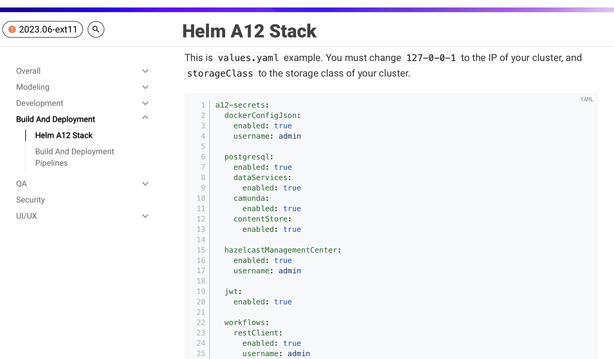

---

# Chunking Challenges: Nuance problems in A12 RAG Docs

- **Problem 3**: A12 Docs also has long table block. Source url: https://geta12.com/#/docs/2023.06/ext11/workflows/dev-docs%23_configuration

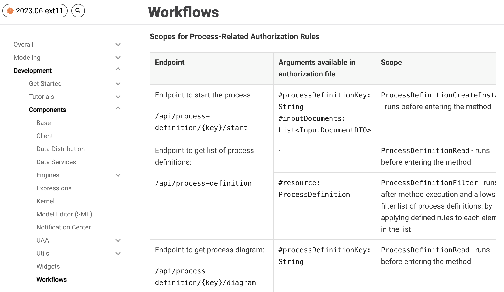

---

# Chunking Challenges: Nuance problems in A12 RAG Docs
- **Problem 4**: A12 Docs contain the table placeholders in markdown and replaced during building of AsciiDoctor

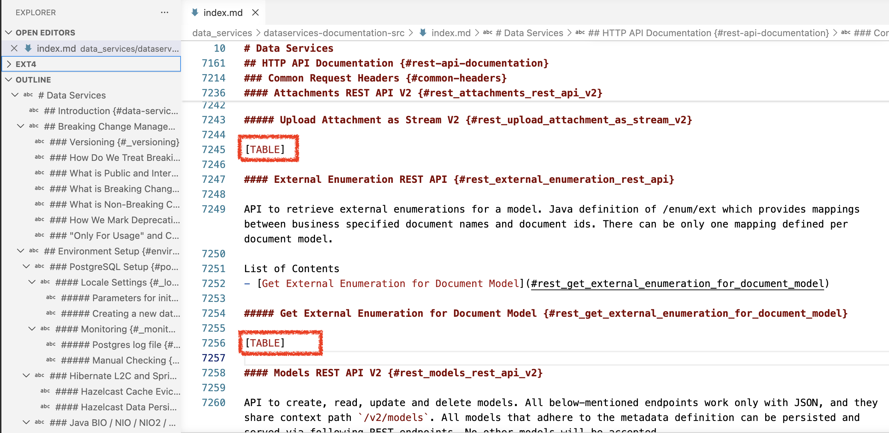

---

# Chunking Challenges: New features in roadmap

 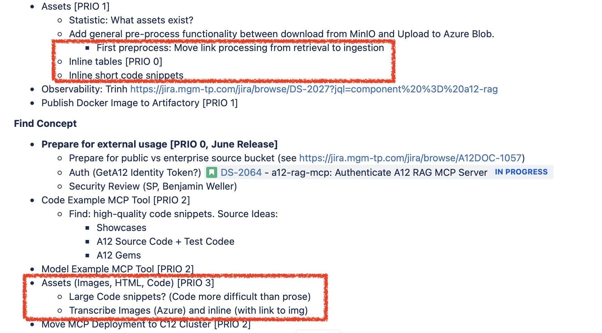

---

# Enhance chunking strategy - Common steps

| Azure AI Search | Milvus Search | 
|---|---|
| Split by headings (h1-h3) | Split by headings (h1-h4) |
| Chunk by character limit (2000 char, 500 overlap)| Chunk by rescursive splitter, char cap limit = 3000, no overlap |

---

# Enhance chunking strategy - Specific steps

| Azure AI Search | Milvus Search | Purpose |
|---|---|---|
| None | Append the breadcrumb on chunk texts | Make similar text in different documents further away, chunks in same docs should have same direction |
| None | Detect inline code and table | Future: Preserve table header across multiple chunks, assist LLM to get full block via tools | 
| None | Detect intra-references in the chunk |Future: return thems in chunk |
| None | Detect sections that overflow in multiple chunks | Provide a new tool to get full section. |

---
# Extend the chunking strategy 

| Aspect | Azure AI search | On premise |
|---|---|---|
| Extend chunking logic| Difficult. Must use more Azure service like Azure Function  | Easy. Just change the code |
| Cost | Pay more cost | Free |
| Dependencies| Add more deps | No more deps |

---

# Compare retrieval strategy

| Azure AI Search | Milvus Search |
|---|---|
| Use hybrid search  | Use hybrid search |
| Use RRF| Use RRF |
| Use built-in semantic reranker | None |

---

# Compare retrieval strategy - Limit reranker

- In Azure AI Search, semantic reranker is fixed (optional), cannot change to another reranker 
- On premise, can choose the diverse reranker supported in Milvus or implement the custom reranker in the code

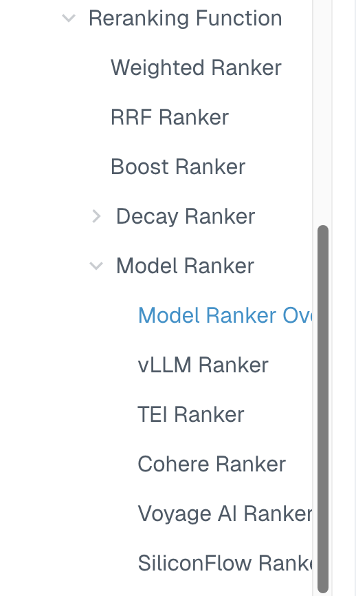

---

# Compare A12 RAG Evaluation
- Azure AI Search
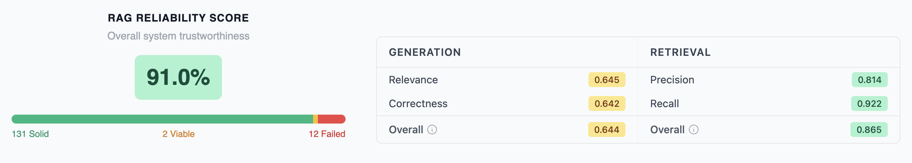
- Milvus Search
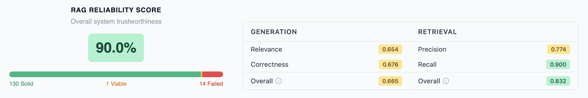

---
# Evaluation Insights between Azure AI Search and Milvus search
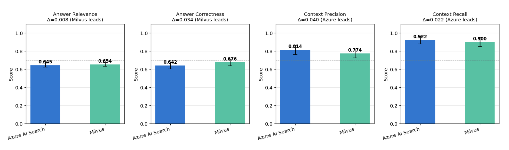

--- 

# Leverage relationship among A12 components to support search
- A12 docs are tech docs and have strong dependencies among components. 

| Layer | Name | Components |
|---|---|---|
| 0 | Utilities & Foundation | utils_localization, utils_logging_collections, utils_server_connector, base, plasma |
| 1 | Core Modeling Foundation | kernel, expression |
| 2 | Design-Time (Modeling) | sme, diagram_editor, tdg |
| 3 | Server Runtime | data_services, uaa, user_management, transformer, data_distribution, workflows |

---

# Leverage relationship among A12 components

| Layer | Name | Components |
|---|---|---|
| 4 | Client Runtime | client, form_engine, overview_engine, tree_engine, crud, relationship_engine, content_engine, notification_center |
| 5 | UI & Output | widgets, print_engine, cms |
| — | Cross-cutting | build_and_deployment, project_template, overall |

---

# Leverage relationship among A12 components
- Enhance MCP instruction to help LLM reasoning better.
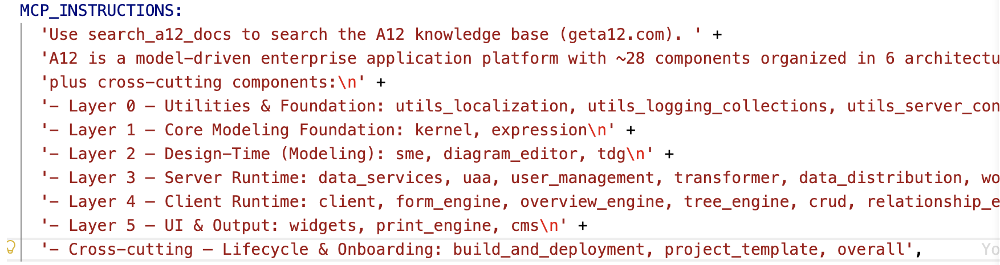

---

# Leverage relationship among A12 components
- Enhance search tool description to LLM reason and auto-make next search better.
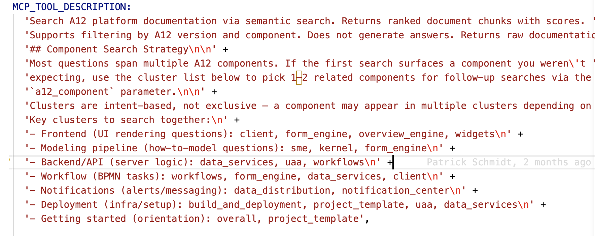

---
# Claude Code with A12 RAG MCP on premise

---

# Claude Code with A12 RAG MCP in Azure
